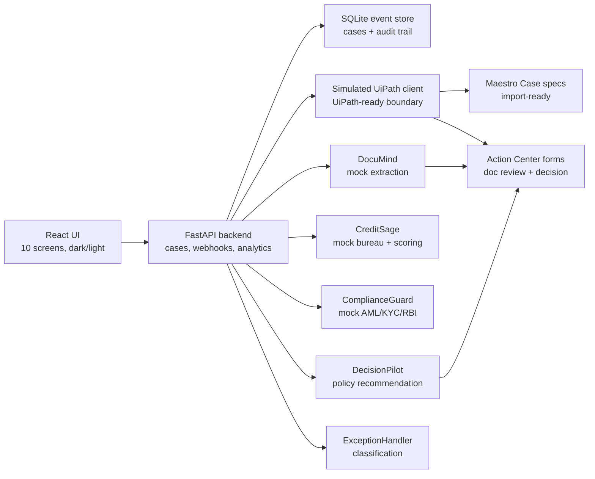

# FinFlow Architecture

## Boundary

Local demo mode is fully runnable without external API keys. UiPath platform
execution remains blocked until Labs access is granted. The `uipath/` artifacts
are import-ready specs, not live tenant evidence.

## Human Gates

- Document review: resolves low-confidence synthetic extraction.
- Final decision: officer approves, rejects, or refers the loan.
